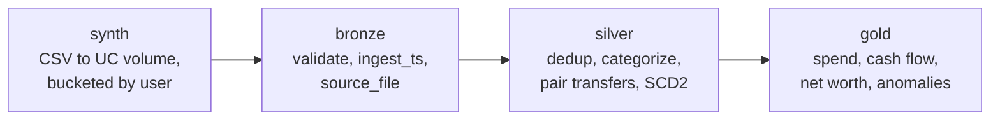

# ducat-lakehouse

[](https://github.com/achowlur/ducat-lakehouse/actions/workflows/ci.yml)

The pipeline layer of [Ducat](https://github.com/achowlur/ducat)'s personal-finance insights
engine, rebuilt on Databricks for many users. Ducat is a local-first, single-user app; this
repo takes its analytics rules (rule-based categorization, transfer pairing, SCD2 balance
history, anomaly scoring) and runs them as a medallion pipeline where every table carries
`user_id`.

All data is synthetic. The generator is deterministic, so a seed reproduces the same rows,
and it plants labeled anomalies so the detector's recall can be measured.

## Pipeline



One Databricks job, four serverless Python wheel tasks in sequence. Job parameters:
`catalog`, `schema`, `volume_path`, `users` (1000), `months` (24), `seed` (42).

| Layer | Tables |
| --- | --- |
| bronze | `bronze_accounts`, `bronze_transactions`, `bronze_balance_snapshots` |
| silver | `silver_transactions`, `silver_account_balance_history` |
| gold | `gold_monthly_spend_by_category`, `gold_cash_flow_monthly`, `gold_net_worth_daily`, `gold_anomalies`, `gold_anomaly_recall` |

## Rules, stated plainly

**Signs.** Amounts are signed: positive is money in, negative is money out. Gold reports
outflows as positive magnitudes; net worth stays signed (card balances are negative).

**Validation.** Bronze checks the columns, types and signs of the first 1,000 rows of each
CSV set before writing anything, and fails fast with the table, column and row at fault.
Every bronze and silver write compares source and target row counts and fails on a mismatch.

**Deduplication.** Rows with the same `(user_id, account_id, posted_date, amount, description)`
are one transaction; the lowest `transaction_id` is kept.

**Categorization.** Rules in `configs/category_rules.yml` are tried in ascending priority;
the first match wins. Operators are `contains`, `equals`, `starts_with` and `regex`, all
case-insensitive. A non-null `user_category` is never overwritten. No match means
`Uncategorized`.

**Transfer pairing.** An outflow and an inflow pair when they belong to the same user, sit
in two different accounts, have exactly opposite amounts, and are at most
`transfer_window_days` (4) apart. Each side picks its closest candidate, ties broken by
`transaction_id`, and a pair stands only when the choice is mutual, so pairing is
one-to-one. Rows with a `user_category` are never paired. Paired rows get
`flow = 'transfer'` and are excluded from every spending figure.

**SCD Type 2 balance history.** Month-end snapshots collapse into versions: a new version
starts only when an account's balance changes. Each version has a surrogate key
(`balance_sk`), `valid_from`, an exclusive `valid_to` (the next version's start), and
`is_current`. The table is rebuilt from bronze on every run. `gold_net_worth_daily`
expands each version over the days it was valid and keeps only days where all of a user's
accounts are known.

**Anomalies.** Each outflow's amount is scored as a z-score against the same user and
category over the trailing 90 days, excluding its own day. A score needs at least 5 prior
outflows and a non-zero spread; above `anomaly_z_threshold` (3) it is flagged.
`gold_anomaly_recall` reports planted, caught, flagged, recall and precision.

## Synthetic data

Each user has one checking, one savings and one card account. Each month has two paychecks,
rent, three to six stable subscriptions, weekly groceries and dining with noise, one or two
checking-to-savings transfers and a card autopay (both as exact opposite legs within four
days), a few exact duplicate rows, and about 0.5% of outflows inflated 5-10x and labeled
`is_planted_anomaly`. Month-end balance snapshots are derived from the transactions.

- `sample_data/`: 5 users, 3 months, seed 42, committed. Regenerate with
  `python -m ducat_lakehouse.synth --sample` (with `src` on `PYTHONPATH`).
- The job's `synth` task writes `<volume_path>/<table>/bucket=NN/part-00000.csv` and refuses
  any path outside `/Volumes/`.

## Tests

No Spark needed. Rule matching, validators and transfer pairing are pure Python in
`rules.py`; silver expresses the same semantics in Spark.

```bash
pip install -r requirements-dev.txt
pytest
```

## Deploy

Requires the [Databricks CLI](https://docs.databricks.com/dev-tools/cli/install.html) signed
in to a workspace (`databricks auth login --host <workspace-url>`). The workspace comes
from your CLI profile or `DATABRICKS_HOST`; nothing in the repo names one.

```bash
databricks bundle validate -t dev
databricks bundle deploy -t dev
databricks bundle run ducat_lakehouse_job -t dev
```

`dev` deploys `[dev <you>] ducat_lakehouse_job` into schema `dev_<you>_ducat` in catalog
`workspace`, with a `raw` volume for the generated CSVs. `prod` uses schema `ducat_prod`.
Pipeline settings live in `configs/pipeline.yml` and are packaged into the wheel.

## CI

`.github/workflows/ci.yml` runs `pytest` on every pull request and push to `main`, then
`databricks bundle validate -t dev`. On push to `main` it also runs
`databricks bundle deploy -t dev`. Credentials come from the `DATABRICKS_HOST` and
`DATABRICKS_TOKEN` repository secrets, never from a file.
